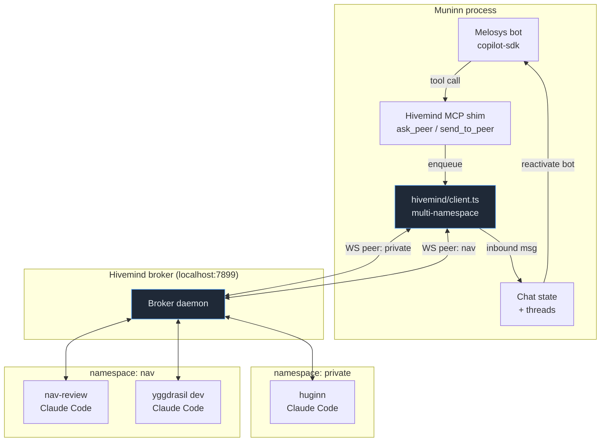
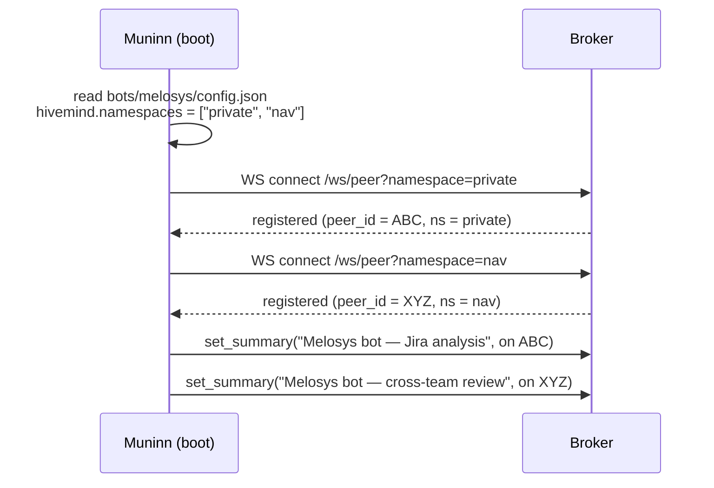
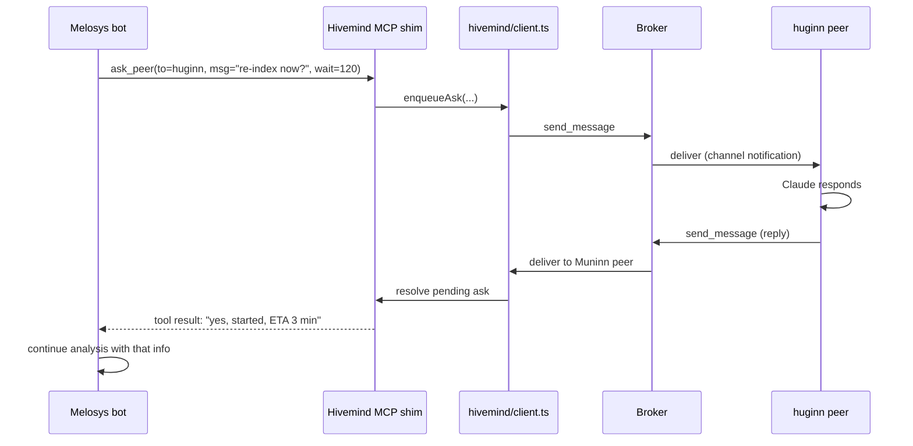
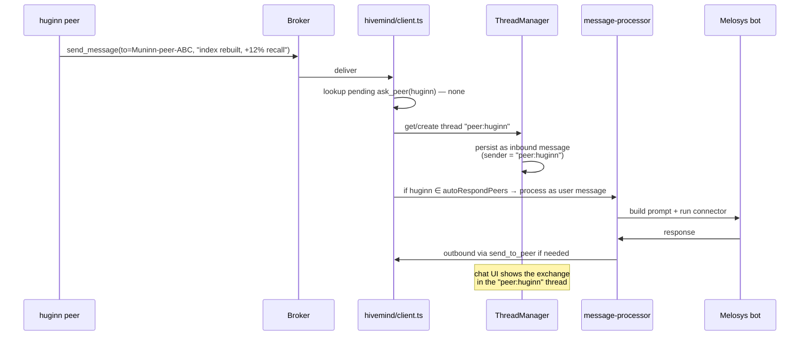
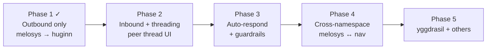

# Plan: Connecting Muninn chat to claude-hivemind

**Status:** Proposal · **Author:** drafted with Claude · **Date:** 2026-04-28

## Goal

Let Muninn bots talk to other Claude Code / OpenCode instances on the same
machine through [claude-hivemind](https://github.com/.../claude-hivemind), so
that:

1. The **melosys** bot can ask **huginn** (and later **yggdrasil**) to improve
   the search index, fix retrieval bugs, or run code investigations on its
   behalf — autonomously, while the bot is analyzing a Jira ticket.
2. The bot can also reach peers in **other namespaces** (e.g. an `nav` peer
   running review/implementation agents), not just its own.
3. Conversations can be long-running and bidirectional — peers may take
   minutes to reply, and replies should land in the chat thread, not get
   dropped.

## Why not "just add the MCP entry"?

The off-the-shelf integration would be: drop `claude-hivemind` into
`bots/melosys/.mcp.json` and spawn the CLI with `CLAUDE_HIVEMIND=1`. That
falls short of the goal for three reasons:

- **Single-namespace lock-in.** Hivemind derives the namespace from the
  spawning process's CWD. The melosys bot runs in
  `~/source/private/muninn/bots/melosys` → namespace `private`. We'd never
  see `nav` peers.
- **No reply path.** The `notifications/claude/channel` push is a
  Claude-Code-only feature, gated behind
  `--dangerously-load-development-channels`. Our `copilot-sdk` and
  `openai-compat` connectors can't receive it. Peer replies that arrive
  after the bot's turn ends would be lost.
- **No persistence.** Hivemind keeps message history in its own SQLite, but
  we want messages threaded into the bot's conversation history, with
  embeddings, traces, and the full Muninn audit trail.

The plan below treats Muninn itself as the hivemind peer, with bots
multiplexed on top.

## High-level architecture



Key idea: **one Muninn process opens N WebSocket connections to the broker —
one per namespace it wants to participate in**. Each WebSocket is its own
peer with its own peer ID. From hivemind's perspective, Muninn looks like
several normal peers; from Muninn's perspective, it's one client with a
namespace-aware routing table.

## Multi-namespace registration

The broker doesn't validate that a registered namespace matches the
client's CWD — it just trusts the `namespace` field in the `register`
message (`shared/types.ts:49-63`). So we can register under any name.



Per-bot config in `bots/<name>/config.json`:

```json
{
  "hivemind": {
    "enabled": true,
    "namespaces": ["private", "nav"],
    "summary": "Melosys assistant — analyzes Jira, asks peers for help",
    "autoRespondPeers": ["huginn", "yggdrasil"]
  }
}
```

| Field | Purpose |
|---|---|
| `enabled` | Master switch. Default off — opt-in per bot. |
| `namespaces` | List of namespaces to join. One WS per entry. |
| `summary` | Initial `set_summary` value. Visible to peers. |
| `autoRespondPeers` | Peer-name allowlist for autonomous replies. Messages from peers **not** in this list arrive but require manual user reply (safety). |

## Outbound: bot calls a peer

The bot gets two new MCP tools (provided by an in-process MCP shim, **not**
the standalone `claude-hivemind` MCP). They live in
`src/hivemind/mcp-tools.ts` and are wired into the bot's existing
`.mcp.json` synthesis path:

| Tool | Behavior |
|---|---|
| `ask_peer(to, message, wait_seconds=120)` | **Blocks within the turn.** Sends `message`, waits up to `wait_seconds` for a reply, returns the reply as the tool result. Use for "is the index up to date?" — quick Q&A while the peer is online. |
| `send_to_peer(to, message)` | **Fire-and-forget.** Returns immediately. Reply (if any) arrives asynchronously and triggers a new bot turn. Use for "please regenerate the embeddings for the Melosys collection" — long task, bot continues without waiting. |
| `list_peers(namespace?)` | Returns peers across all joined namespaces (or a specific one). |



For `ask_peer`, the shim keeps an in-memory map of `{peer_id → resolver}`
and resolves it when an inbound message from that peer arrives. Timeout
returns a tool result of `"no reply within 120s — try send_to_peer"` so
the bot can decide what to do.

## Inbound: peer message arrives

This is the critical bit for long-running back-and-forth. Two cases:

**Case 1 — reply to a pending `ask_peer`.** Resolved silently inside the
shim (above sequence). Bot sees it as the tool result.

**Case 2 — unsolicited message, or async reply to `send_to_peer`.** No
pending tool call. The message becomes a new turn in a dedicated thread.



Each peer gets its own thread (`peer:<peer-name>`) per bot, separate from
human chat threads. The chat page renders these like any other thread —
you can read the conversation, jump in, take over, mute the auto-respond.

## Blocking vs async — recommendation

You asked about this. I recommend **both, with `ask_peer` as the default
for in-turn questions and `send_to_peer` for long tasks**. Three reasons:

1. **Bot ergonomics.** Most "talk to peer" cases during Jira analysis are
   short Q&A: *"is the index for collection X up to date?"*. Blocking with a
   2-minute timeout matches what the bot expects from any other tool.
2. **Async is essential for the huginn use case.** "Please fix the indexer
   bug and rerun" takes minutes-to-hours. The bot's turn must end so the
   user sees the analysis-so-far, and huginn's reply lands as a new
   message later.
3. **Failure mode is graceful.** `ask_peer` timing out doesn't break the
   turn — the tool returns a hint to switch to `send_to_peer`. The bot can
   recover.

### Loop-prevention guardrails

Auto-respond is the dangerous knob. To stop runaway exchanges:

- Hard cap: **max 20 auto-respond turns per peer thread per hour**, then
  the thread requires manual unmute.
- Cost cap: per-thread token budget (reuse `haiku_usage` table pattern).
- Kill switch: chat UI button "Pause auto-respond" per thread.
- Audit: every inbound and outbound peer message gets a `traces` entry so
  you can see the full chain in the waterfall view.

## Per-bot config schema (full)

```json
{
  "hivemind": {
    "enabled": true,
    "namespaces": ["private", "nav"],
    "summary": "Melosys — Jira analysis, asks peers for help",
    "autoRespondPeers": ["huginn", "yggdrasil"],
    "maxAutoTurnsPerHour": 20,
    "askPeerDefaultTimeoutSec": 120,
    "exposeToTools": true
  }
}
```

`exposeToTools: true` adds `ask_peer` / `send_to_peer` / `list_peers` to
the bot's tool list. Set to `false` if you want Muninn-as-peer for
inbound-only (you talk to peers from the chat UI, but the bot can't
initiate outbound).

## Module plan

New files:

| Path | Role |
|---|---|
| `src/hivemind/client.ts` | Multi-namespace WS client. One connection per namespace. Reconnect with backoff (mirror `server.ts:178-198`). Heartbeat every 30s. |
| `src/hivemind/types.ts` | Re-export of `claude-hivemind/src/shared/types.ts` (or thin copy if we don't want a workspace dep). |
| `src/hivemind/router.ts` | Inbound message router: dispatch to pending `ask_peer` resolvers, else create/append to peer thread. |
| `src/hivemind/mcp-tools.ts` | In-process MCP server exposing `ask_peer` / `send_to_peer` / `list_peers`. Wired into bot startup so each bot has its own instance with the right namespace scope. |
| `src/hivemind/config.ts` | Schema + parser for `bots/<name>/config.json` `hivemind` block. |
| `src/hivemind/loop-guard.ts` | Per-thread turn counter + token budget enforcement. |
| `src/hivemind/client.test.ts` | WS reconnect, multi-namespace registration, heartbeat. |
| `src/hivemind/router.test.ts` | Pending ask resolution, thread routing, autorespond gating. |

Modified files:

| Path | Change |
|---|---|
| `src/index.ts` | Boot `HivemindClient` after DB init; wire to chat state. |
| `src/bots/config.ts` | Parse `hivemind` block from `config.json`. |
| `src/chat/state.ts` | Add `peer:` thread namespace; mark inbound peer messages with `sender: "peer"`. |
| `src/chat/views/components/thread-manager.ts` | Render peer threads with a robot icon + "Pause auto-respond" toggle. |
| `src/dashboard/views/page.ts` | Add hivemind status panel: connected namespaces, peer count, recent peer activity. |
| `src/ai/connectors/copilot-mcp.ts` | If `hivemind.exposeToTools`, append the in-process MCP shim to the SDK's tool list. (claude-cli connector picks it up automatically via `.mcp.json` synthesis.) |

DB:

| Table | Change |
|---|---|
| `threads` | New row type — name pattern `peer:<peer-name>`, no FK to `users` (peer thread is bot-owned). |
| `messages` | New `sender` value `"peer"` with `from_peer_id` column (nullable, only set for peer messages). |
| Migration | `db/migrations/NNN_hivemind_peer_messages.sql` — add `from_peer_id TEXT NULL` to `messages`. |

## Phased rollout



**Phase 1 — done (2026-04-28).** Commits: `f4ab41e` (initial module),
`b2fc1c3` (timeout + registration fixes). Branch `hivemind-phase-1`.
Verified end-to-end: melosys bot asks huginn a question during Jira
analysis, gets a reply within the same turn, FIFO resolver matches by
`from_id`. Two bugs surfaced and fixed during manual testing:

- **`ask_peer` returned `fetch failed` after ~10s** — Bun.serve's default
  idle timeout was tearing down the bot's MCP HTTP request before peers
  replied. Fixed by setting `idleTimeout: 255` on the hivemind MCP
  server and clamping `wait_seconds` to 240s for headroom.
- **WS would open but never receive `registered`** — observed during
  `bun --watch` hot reloads. The WS upgrade succeeded, register was
  sent, but no reply came back; the client sat with `peerId === null`
  and `isConnected === false`. Fixed by adding a 5s registration
  timeout that force-closes the WS so exponential-backoff reconnect
  takes over.

**Phase 2 (1 day).** Inbound router + peer threads in chat UI. No
auto-respond yet — peer messages just appear in the thread, you reply
manually. See "Phase 2 acceptance criteria" below for concrete scope.

**Phase 3 (1 day).** `autoRespondPeers` allowlist + loop guards + traces
integration. Now huginn can autonomously fix things on melosys's request.

**Phase 4 (½ day).** Add second namespace registration to melosys config
(`["private", "nav"]`). Verify cross-namespace `list_peers` and routing
works.

**Phase 5 (when ready).** Onboard yggdrasil. Mostly a config change unless
yggdrasil has its own quirks.

## Phase 2 acceptance criteria

Carrying forward from Phase 1:

- `HivemindBotClient.onIncomingMessage` callback exists in `client.ts`
  but is unwired. Phase 2 routes it to a chat thread.
- The melosys bot is already a registered peer — no changes needed to
  `manager.ts` boot for Phase 2.
- Constraints from Phase 1 testing: `ask_peer` wait is bounded to 240s
  by the MCP HTTP idle timeout. Don't try to make `ask_peer` itself
  longer; instead, async replies (Phase 2) handle long-running cases.

### Confirmed Phase 2 decisions (2026-04-28)

These were resolved in the kickoff conversation before implementation
started. Locked in:

- **Branch base.** Branch `hivemind-phase-2` off `main` (Phase 1 PR #73
  was squash-merged as `c303455`; the `hivemind-phase-1` branch is
  redundant).
- **`user_id` for peer threads.** Reuse the **bot's default user** (the
  synthetic owner introduced in migration 027). `threads.user_id` is
  `NOT NULL`, and a peer thread has no real user — using the bot's
  default user lets peer threads appear next to the owner's other
  threads in the sidebar without schema changes.
- **Thread name.** `peer:<cwd-basename>`, derived from the inbound
  message's `from_cwd`. The broker's `from_id` is a per-session UUID
  that rotates on peer reconnect; the cwd basename (e.g. `huginn`,
  `yggdrasil`) is stable across sessions and human-readable, so the
  same long-running conversation lands in the same thread on
  reconnect.
- **Manual outbound from chat.** Text-prefix convention `>peer-id
  message…` in the chat send path. No new button or modal — keeps the
  UI surface untouched for Phase 2.
- **Inbound → chat WebSocket routing.** Reuse the bot-default-user's
  existing `web` conversation and emit a `message` event with the peer
  thread's `threadId`. No new `ConversationType` — the existing
  thread-sidebar UI surfaces peer threads automatically once their
  rows exist in `threads`.

### Required for Phase 2 to be "done"

1. **DB migration** `db/migrations/035_hivemind_peer_messages.sql`:
   add `from_peer_id TEXT NULL` to `messages`. Update `saveMessage`
   and the relevant `getMessages` paths to round-trip the field.
2. **Thread routing** in `src/hivemind/router.ts` (new module):
   - On inbound peer message, find or create a
     `peer:<cwd-basename>` thread owned by the bot's default user.
   - Append the message with `sender: "peer"` (stored as a new role
     value or via a sender mapping — see implementation note below)
     and `from_peer_id` set to the broker's `from_id`.
   - Broadcast a chat event so any open chat-page WebSocket sees it
     in real time.
3. **Chat state** `src/chat/state.ts`: add `"peer"` to the
   `ChatMessage` sender union; teach hydration to load peer-thread
   messages with the right sender value.
4. **UI** `src/chat/views/components/thread-manager.ts`: render peer
   threads with a distinct icon (small antenna/bot glyph) and a
   `[from peer-id]` prefix on inbound messages. No "Pause
   auto-respond" toggle yet — that's Phase 3.
5. **Manual outbound from chat**: detect the `>peer-id message…`
   prefix in the chat send handler and route through the bot's
   `HivemindBotClient.sendMessage()` instead of the connector. The
   thread → peer-id mapping uses the most-recent `from_peer_id` for
   that thread.
6. **Tests**: extend `client.test.ts` with a stubbed broker
   delivering an unsolicited message and verify the router persists
   it. New `router.test.ts` covers thread create/find logic with the
   real test DB (mirrors the rest of the project's DB-test pattern).

Out of scope for Phase 2 (deferred to Phase 3+):

- Autorespond / autonomous bot replies to peer messages
- Loop guards / token budget
- Trace span emission for peer messages
- Multi-namespace registration (Phase 4)

## Risks & open questions

1. **Multiple Muninn peers in the same namespace.** If you run two Muninn
   instances (dev + prod), both register peers with the same `cwd`/git
   root but different PIDs. Hivemind's dashboard handles this — we just
   need to make sure our peer summary disambiguates ("muninn-dev" vs
   "muninn-prod"). Solution: append `process.pid` to the summary.

2. **Broker not running when Muninn boots.** Hivemind auto-starts the
   broker when an MCP server detects it's gone (`server.ts:112-132`). We
   should mirror this: if connect fails, spawn `bun
   ~/source/private/claude-hivemind/src/broker.ts` ourselves, then retry.
   Path is configurable via env (`HIVEMIND_BROKER_SCRIPT`).

3. **`ask_peer` blocking the connector.** The Claude CLI tool call is
   synchronous from Claude's perspective — it'll wait happily for 2
   minutes. The copilot-sdk and openai-compat connectors also support
   long tool calls. Verified safe.

4. **Cost.** Auto-respond + huginn doing real work = real LLM cost on the
   peer side. The token budget guard helps, but worth monitoring with the
   existing `haiku_usage` dashboard.

5. **Trust boundary.** A peer in the `nav` namespace can send arbitrary
   text to melosys's bot. If `autoRespondPeers` includes that peer, that
   text becomes a prompt. Threat model is "peer is friendly but might
   misbehave" — same as any tool output. The persona's system prompt
   should not blindly trust peer messages with elevated authority. Worth
   adding a paragraph to bot personas that mentions peer messages.

6. **Channel push compatibility.** Pure Muninn-as-peer doesn't need the
   `claude/channel` extension, so we're not blocked on Claude Code 2.1.80
   or the dangerously-load flag. The peers we talk to (huginn, yggdrasil)
   need that flag for *them* to receive our messages — that's their setup,
   not ours.

## Confirmed decisions (2026-04-28)

- **Namespaces for melosys:** `["private", "nav"]`.
- **Autorespond default:** off — allowlist-only via `autoRespondPeers`.
- **Hivemind install path:** `~/source/private/claude-hivemind`. The
  broker auto-start path will use `bun
  ~/source/private/claude-hivemind/src/broker.ts`, overridable via
  `HIVEMIND_BROKER_SCRIPT` env var.
- **Phase 1 greenlit.**
