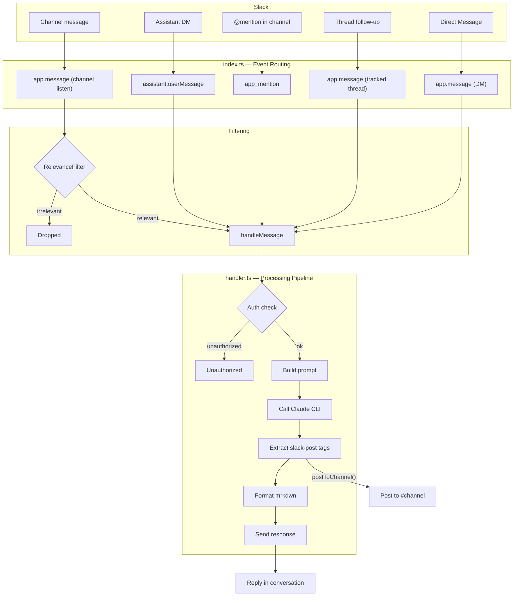
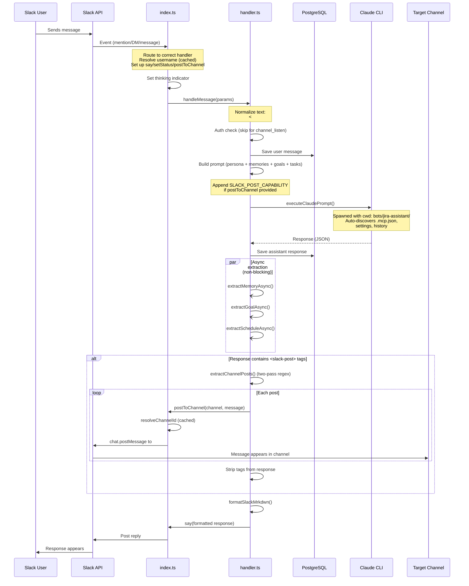
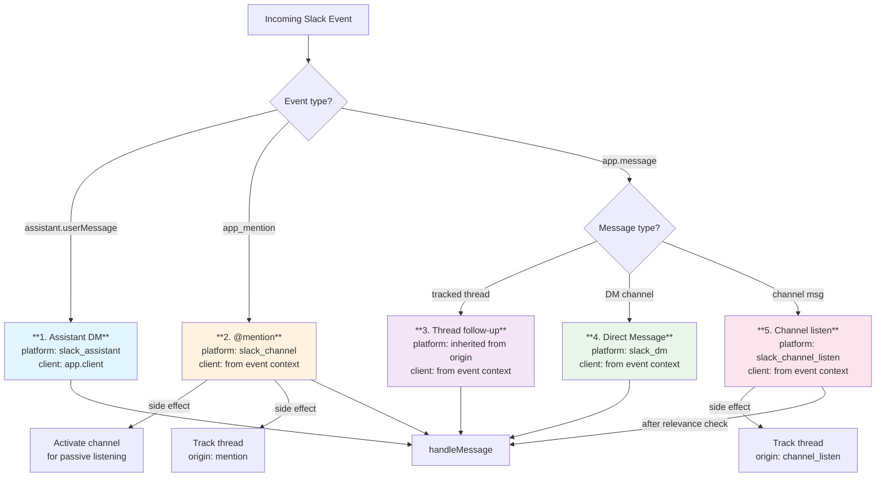
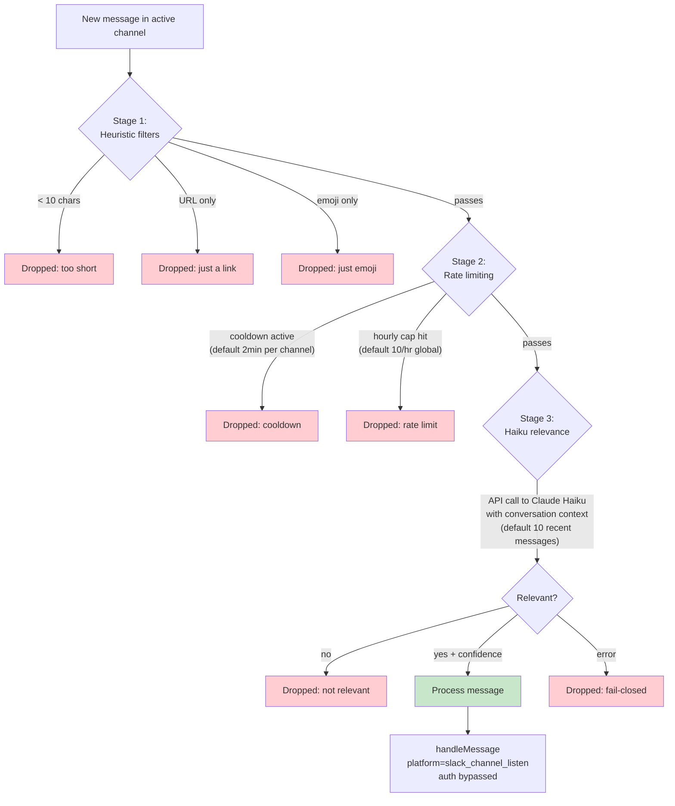
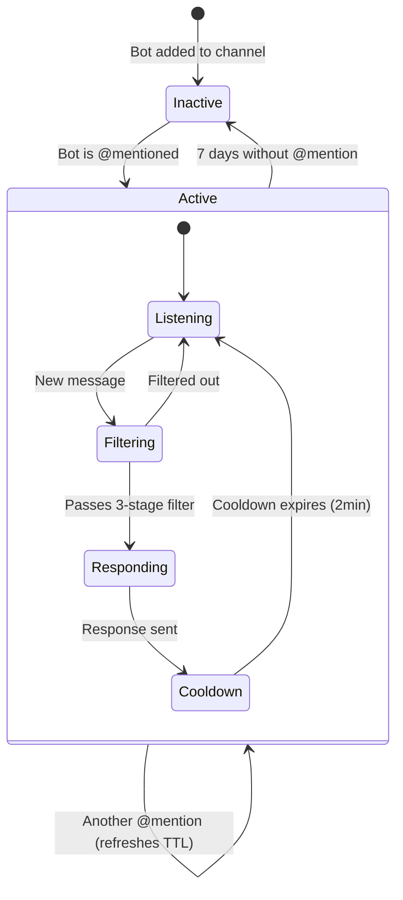
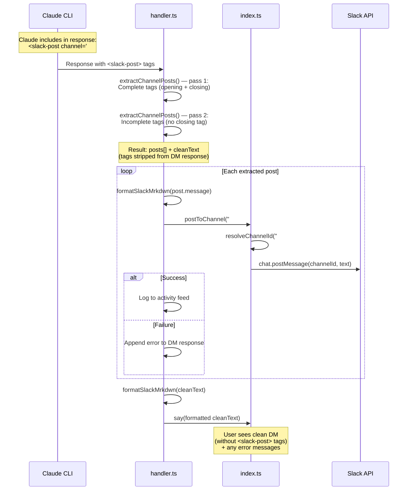
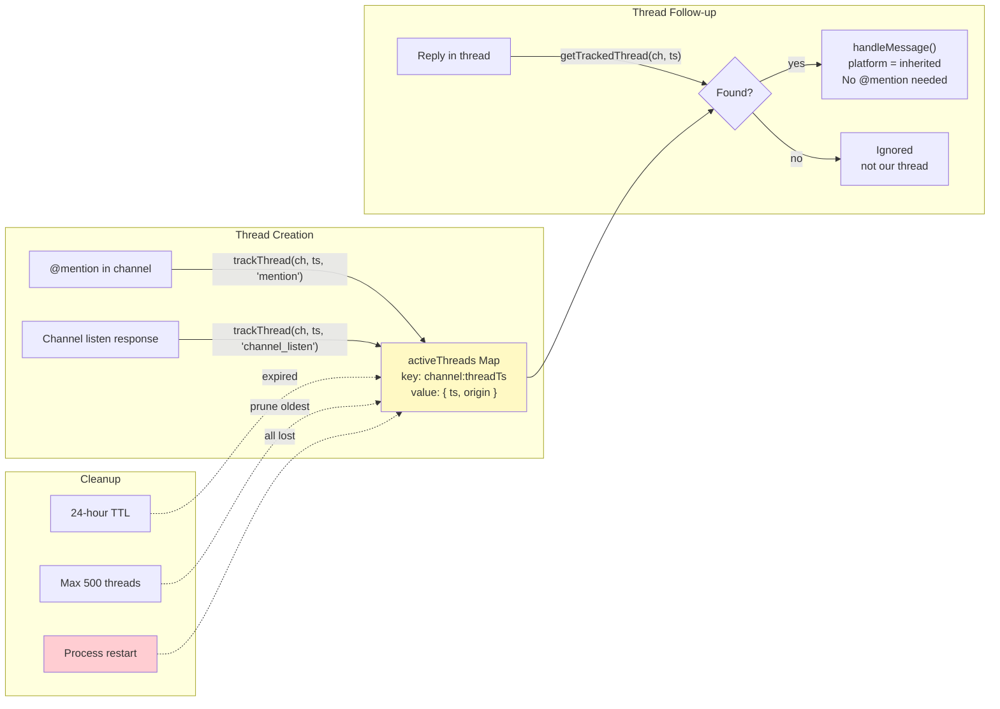
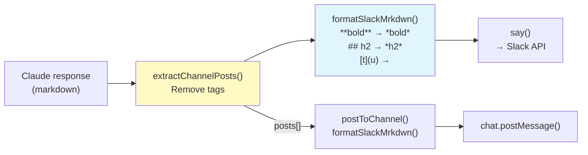

# Slack Integration — Architecture & Message Flow

## Overview

The Slack integration uses `@slack/bolt` in Socket Mode. A single Bolt app handles five distinct message paths, all funneled through one central handler that calls Claude and manages side effects.

## High-Level Architecture



## Complete Message Flow



## The Five Handler Paths



## Channel Listening Pipeline

When the bot is @mentioned in a channel, that channel becomes "active" for passive listening. Subsequent messages go through a 3-stage filter:



### Channel Activation Lifecycle



## postToChannel Flow

This is how Claude posts messages to specific Slack channels from any conversation:



## Thread Tracking



## Thinking Indicators by Path

| Path | Method | Visual |
|---|---|---|
| Assistant DM | `setStatus("Thinking...")` | Native Slack thinking bubble |
| @mention | `assistant.threads.setStatus({status: "tenker..."})` | Native thinking bubble in thread |
| Thread follow-up | `assistant.threads.setStatus({status: "tenker..."})` | Same as @mention |
| DM (app.message) | Post `_Tenker..._` → replace with `chat.update()` | Italic text, then replaced |
| Channel listen | `assistant.threads.setStatus({status: "tenker..."})` | Native thinking bubble |

> `assistant.threads.setStatus()` requires the Slack app to have "Agent or Assistant" enabled. Always wrapped in try-catch — fails silently if not available.

## Handler Parameters Comparison

Every handler path calls `handleMessage()` with these parameters:

| Parameter | Assistant DM | @mention | Thread follow-up | DM | Channel listen |
|---|---|---|---|---|---|
| `platform` | `slack_assistant` | `slack_channel` | inherited | `slack_dm` | `slack_channel_listen` |
| `postToChannel` | `app.client` | `client` | `client` | `client` | `client` |
| `channelContext` | - | `#channel-name` | `#channel-name` | - | `#channel-name` |
| `setStatus` | Bolt's Assistant API | `assistant.threads.setStatus` | `assistant.threads.setStatus` | no-op | `assistant.threads.setStatus` |
| Auth | checked | checked | checked | checked | **bypassed** |

## Formatting Pipeline



## Configuration

Per-bot config in `bots/<name>/config.json`:

```json
{
  "model": "sonnet",
  "thinkingMaxTokens": 16000,
  "channelListening": {
    "enabled": true,
    "cooldownMs": 120000,
    "maxResponsesPerHour": 10,
    "relevanceThreshold": "medium",
    "contextMessages": 10,
    "topicHints": ["software", "IT", "AWS", "Kotlin", "React"]
  }
}
```

Environment variables (in `.env`):
```
SLACK_BOT_TOKEN_CAPRA=xoxb-...
SLACK_APP_TOKEN_CAPRA=xapp-...
SLACK_ALLOWED_USER_IDS_CAPRA=UH8RUJQLD,U12345
```
