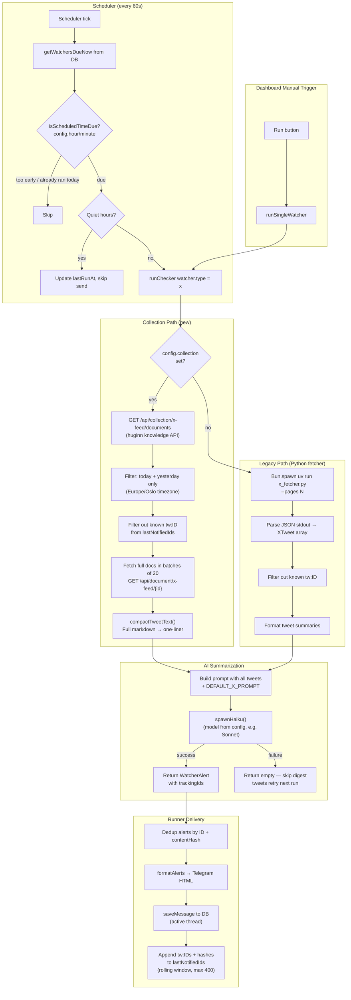
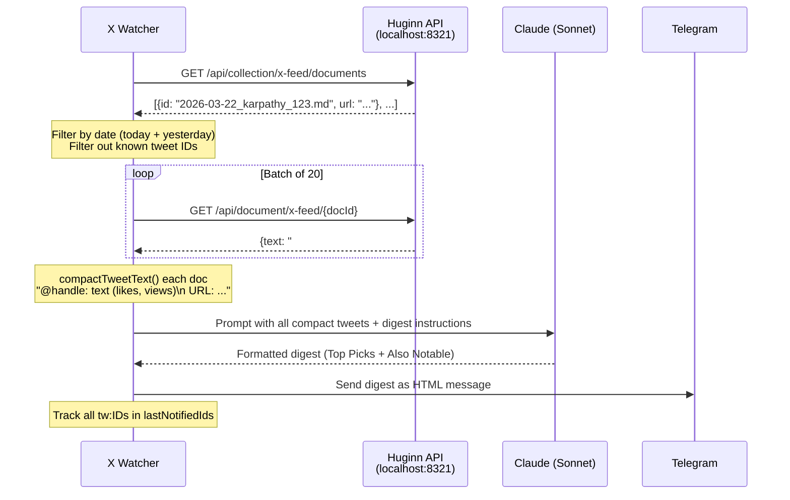
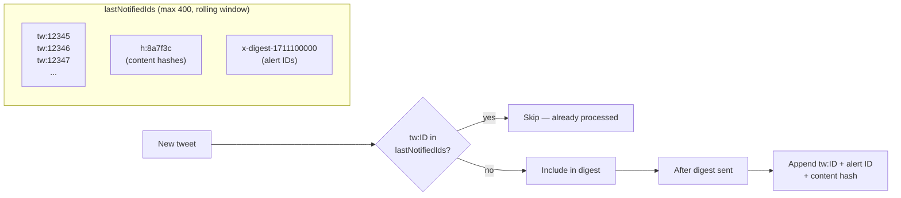

# X/Twitter Watcher — Collection-based Architecture

## How it works

The X watcher produces a daily digest of your Twitter/X timeline and sends it via Telegram. It has two data paths, selected by the `collection` config field:



## Collection path: how it gets tweets from huginn

The huginn knowledge system has an `x-feed` collection that is **indexed and updated hourly** by a separate process (the huginn x fetcher + indexer). The X watcher doesn't call the X API at all — it reads from this pre-built index.



### Why compact text matters

Huginn stores tweets as full markdown documents (~500 bytes each). Sending 80 full documents to Sonnet caused **180s+ timeouts**. The `compactTweetText()` function strips each document down to a single line:

```
Before: "# @karpathy — Andrej Karpathy\n\nLong tweet...\n\n---\n\n- **Engagement:** 1,508 likes..."
After:  "@karpathy: Long tweet (1,508 likes, 524k views)\n  URL: https://x.com/..."
```

### Date filtering

The collection contains **all** indexed tweets (800+). Without filtering, the watcher would re-process ancient tweets. Filtering uses `Europe/Oslo` timezone to match huginn's date convention in filenames:

```
Document ID format: 2026-03-22_handle_tweetid.md
                    ^^^^^^^^^^
                    Date prefix used for filtering
```

## Scheduled run vs manual run

Both go through the **same `runWatchers` code path** — same tracing, same dedup, same delivery.

The dashboard "Run" button sets `force_next_run = true` in the DB. On the next scheduler tick (up to 60s), the watcher is picked up and run with these differences:

| Aspect | Scheduled | Manual (`force_next_run`) |
|---|---|---|
| **How it's triggered** | Interval elapsed (`interval_ms`) | `force_next_run = true` in DB |
| **Time-of-day check** | Yes — `isScheduledTimeDue()` | Skipped |
| **Quiet hours** | Yes — skips send | Skipped — always sends |
| **Tracing** | Yes | Yes (with `manualTrigger: true` attribute) |
| **Everything else** | Same | Same |

After the run completes, `updateWatcherLastRun()` clears `force_next_run = false`.

## Dedup strategy



- **Pre-fetch dedup** (collection path): tweet IDs are checked _before_ fetching full documents from huginn, avoiding wasted API calls
- **Post-digest dedup** (runner): alert ID + content hash + tracking IDs are appended to the rolling window
- **Alert ID** (`x-digest-{timestamp}`) is always unique — never actually deduped by ID itself
- **trackingIds** (`tw:{tweetId}`) are the real dedup keys — they survive across runs

## Config reference

Set via the dashboard Edit tab on the watcher, stored in the watcher's JSONB `config` column:

| Field | Default | Description |
|---|---|---|
| `collection` | _(unset)_ | Collection name (e.g. `"x-feed"`). Enables collection path. Omit for legacy Python fetcher. |
| `model` | `claude-haiku-4-5` | Model for summarization. Use `"claude-sonnet-4-6"` for better quality. |
| `timeoutMs` | `60000` | Model call timeout in ms. Set `180000`+ for Sonnet. |
| `maxDocs` | `80` | Max documents per digest run. |
| `prompt` | `DEFAULT_X_PROMPT` | Custom digest prompt (overrides the built-in two-tier format). |
| `hour` | _(unset)_ | Hour (0-23, Europe/Oslo) to run. Makes it a daily digest. |
| `minute` | `0` | Minute within the hour to run. |
| `pages` | `3` | Pages for legacy Python fetcher (ignored in collection mode). |
| `apiUrl` | `KNOWLEDGE_API_URL` env | Huginn knowledge API URL. |

## File map

| File | Purpose |
|---|---|
| `x.ts` | X watcher — both data paths, `compactTweetText`, prompt building, AI call |
| `runner.ts` | Generic watcher runner — scheduling, dedup, delivery, `runSingleWatcher` |
| `email.ts` | Email watcher (separate type, same runner) |
| `news.ts` | News watcher (separate type, same runner) |
| `quiet-hours.ts` | Per-user quiet hours check |
| `CLAUDE.md` | Lessons learned and architecture notes for AI assistants |
