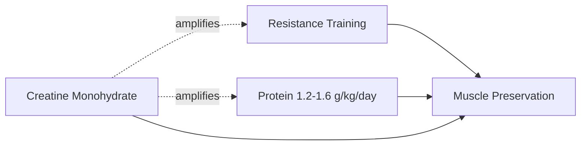

# Creatine Loading Protocol for Older Adults

Creatine loading (colloquially "mega-dosing") is a supplementation protocol — 20g/day split into four 5g doses for 5–7 days, followed by a 3–5g/day maintenance dose — designed to reach muscle creatine saturation faster than standard low-dose supplementation achieves over several weeks. In adults over 50, it is studied as a countermeasure to age-related muscle and cognitive decline, and it is frequently confused with kidney harm due to a widely misread lab marker.

## Mechanism

Creatine is synthesized from three amino acids — arginine, glycine, and methionine — and stored primarily in skeletal muscle, where it buffers the rapid regeneration of ATP during short, intense bursts of effort: lifting, climbing stairs, standing up from a chair. Aging reduces the muscle's capacity to store creatine, contributing to **sarcopenia**, the progressive loss of muscle mass and function that drives frailty, fall risk, and loss of independence — not merely a cosmetic decline. Dietary intake alone cannot compensate: matching a therapeutic supplement dose would require several pounds of red meat per day.

Loading does not increase the ceiling of muscle creatine storage — it only accelerates the timeline to reach the same saturation point that a standard 3–5g/day dose reaches gradually over weeks.

## Evidence in Adults 50+

Randomized trials in adults in their 50s through 70s report:

- Roughly 1kg of additional lean muscle mass gained versus resistance training alone.
- Improved upper- and lower-body strength, including better performance on the chair-rise test, a predictor of fall risk and functional independence.
- Improved short-term memory and processing speed, most pronounced under sleep deprivation or high cognitive load — an effect attributed to creatine buffering brain ATP the same way it buffers muscle ATP.

Notably, the cognitive benefit appears strongest at standard **maintenance** doses rather than during the higher-dose loading phase, suggesting the muscle and brain effects may not scale with dose in the same way.

## The Creatinine vs. Cystatin C Confusion

A common source of alarm is a rise in serum **creatinine** after starting creatine supplementation, which is often misread as evidence of kidney damage. Creatinine is simply the waste byproduct of creatine breakdown and is expected to rise with supplementation and with higher muscle mass — it does not indicate impaired kidney function in this context.

| | Creatinine | Cystatin C |
|---|---|---|
| What it is | Waste byproduct of creatine breakdown | Protein filtered by kidneys at a steady rate |
| Rises with creatine supplementation? | Yes (expected) | No |
| Affected by muscle mass/diet? | Yes | No |
| Reliability for kidney function while supplementing | Low/misleading | High — recommended baseline |

<Callout>
Rising creatinine on creatine is an expected metabolic byproduct, not a kidney injury signal. A Cystatin C test provides a muscle-mass-independent baseline for actual kidney function.
</Callout>

## The Three-Legged Stool

Creatine's benefits are conditional, not standalone:

Creatine monohydrate — the cheapest and most-studied form, distinct from HCl or "buffered" variants — amplifies gains from resistance training and adequate protein intake but produces little benefit as a pill taken in isolation.

## Candidates and Contraindications

Best candidates for loading:
- Vegetarians and vegans, who start with the lowest baseline creatine stores.
- Adults over 60, due to anabolic resistance and sarcopenia risk.
- Beginners to resistance training.

Avoid or seek medical guidance first if pregnant or breastfeeding, diagnosed with bipolar disorder (may worsen mania), managing Parkinson's disease with regular caffeine use, prone to GI upset, or living with existing kidney disease. Standard 3–5g/day dosing remains effective for those who skip the loading phase — it simply reaches saturation more slowly.

<Verdict>
The "creatine damages kidneys" fear rests on a misread lab value; the real signal worth tracking is Cystatin C, not creatinine. For adults over 50 already doing resistance training and eating adequate protein, creatine monohydrate is a low-cost, well-studied addition with benefits extending beyond muscle to brain energy and memory.
</Verdict>

## See also
- [[Creatine and Testosterone]]
- [[Creatine for Brain Health]]
- [[Creatine Side Effects]]
- [[Metabolic Health]]
- [[Mitochondrial Health]]
